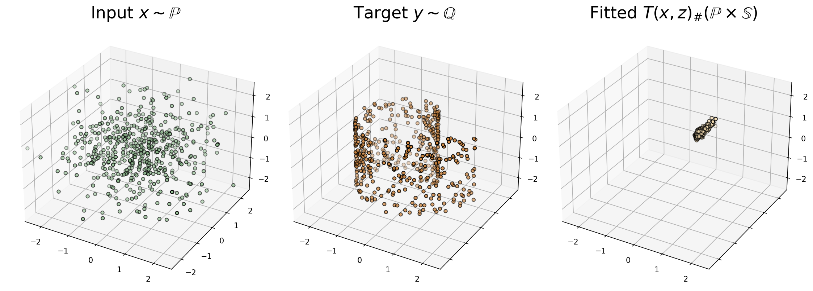

# Extragradient Optimization for Neural Optimal Transport

Neural optimal transport solves the optimal tranport with cost $c$ by solving the minimax optimization for the transport map $T$ and Kantorovich potential $f$

$$
\displaystyle \sup_{f} \inf_{\mathcal{T}} \mathcal{L}(f, \mathcal{T}) = \sup_{f} \inf_{\mathcal{T}} \Big\[ \displaystyle\int_{x} \left( c(x, \mathcal{T}(x)) - f(\mathcal{T}(x)) \right) d\mathbb{P}(x) + \int_{y} f(y) d\mathbb{Q}(y) \Big\]
$$

Here, we compare the performance of the Adam and ExtraAdam optimizers for this task. Since extragradient methods are tailored to solve this type of task, we observe better convergence properties with ExtraAdam than with Adam.

Comparison of loss dynamics for Adam and ExtraAdam optimizers

ExtraAdam losses for T and f:

Adam losses for T and f:

Final fitted distribution for ExtraAdam:

Final fitted distribution for Adam:

